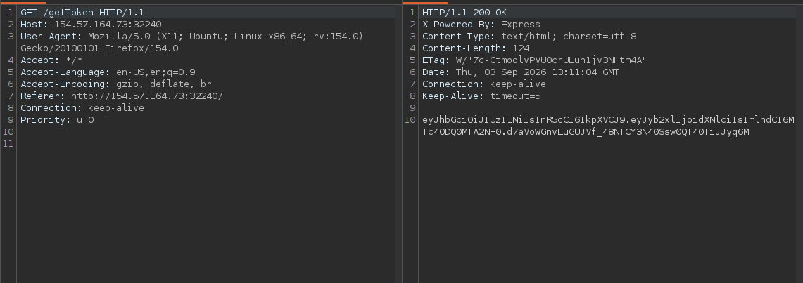
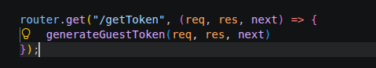

## Step 1: Obtain a guest token

Call `/gettoken` to receive a guest JWT.

## Step 2: Identify the signing secret

The secret shown in the challenge source is not the active secret because the application loads its environment from the live `.env` file. Forging the token with the source value therefore does not work.

Most application endpoints require admin authorization, so the next step is to retrieve the live environment file and use its JWT secret to create an admin token.

